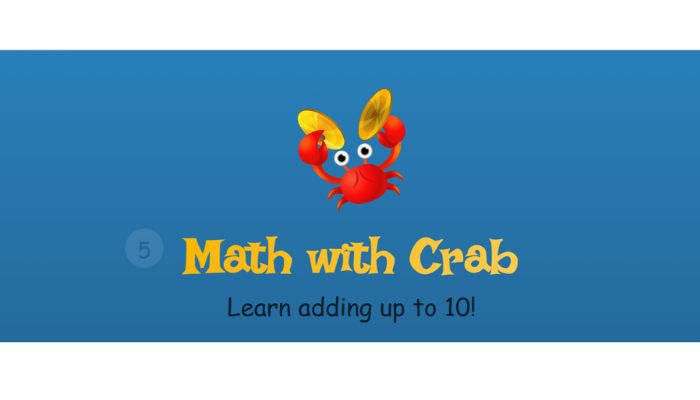
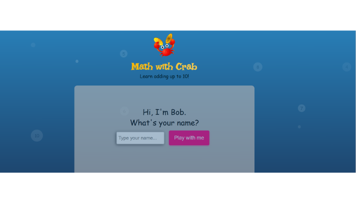
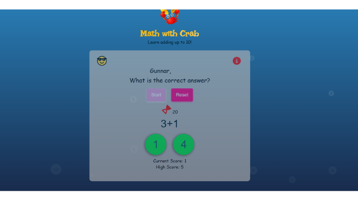
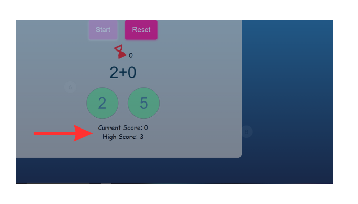
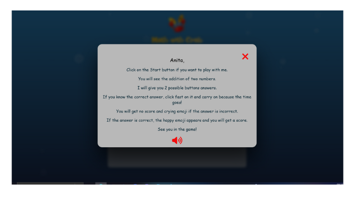
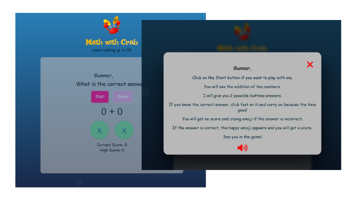
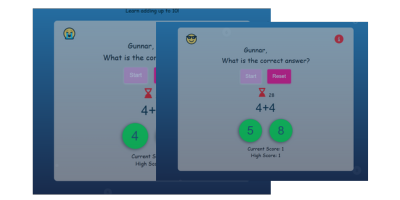
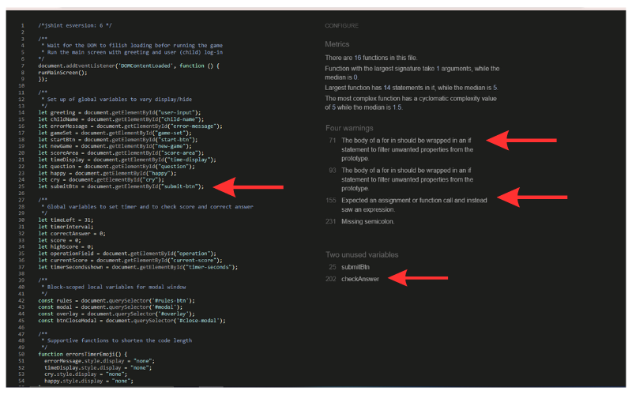
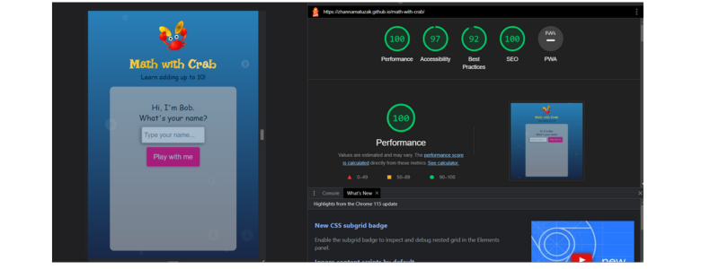

# Math with Crab

Marth with crab is a website game for children to practice adding numbers. In addition to it the user practices to type both the lowercase and uppercase letters. It is aimed at children between 6 and 8 years old. For children who are under this age adult assistance is required. This website hopes to make addition both fun and educational. The website is child-friendly to the ways it interacts with the user. You can visit the site [here](https://ui.dev/amiresponsive?url=https://zhannamatuzak.github.io/math-with-crab/).

https://ui.dev/amiresponsive?url=https://zhannamatuzak.github.io/math-with-crab/

## Features 

- Math with Crab Heading and Main Image
    - At the top of the page, the Math with Crab logo title and crab logo image immediately let the user know that they're on a Maths website for children which has a game to play. 
    - The hint message belov tells the user that he can add numbers to ten.
    - The title has an animation the style of which I borroved from this [project](https://aleksandracodes.github.io/CI_PP2_SunshineGuessing/index.html).

    
  
- Greeting and Log in area
    - The greeting text from Bob is presented at the main screen. Bob asks the user to type his name. This is where the user can input his name or imaginary name.

     

    - The first letter should be capital. And the number of letters must be to 10. It needs some effort from the user (child).

     

    - Test: I tested this featute on my son. He likes this part a lot because he can type everything he wants and than read these funny words which he sees on the game area and modal window areas later on. It develops imagination. After two days he can type his name easily because he remembers where the letter are placed on the keyboard.

- The Game Area

    - This is where the game will be played. It included multiple buttons: to start the game, reset the game, the game question, choose and submit their answer; operation area; and score area: current and high.
    - Before the game starts, the only button which is enabled and clickable is the start button. This encourages the user to click the start button and engage with the game content.
    - There is the rules button on the top right corner. The button is active before, during and after the game.

    

- Timer
    - The timer is triggered by clicking the Start button and can be reset at any point after then with the Reset button.
    - The Start button will be made disabled whilst the timer is running, so users cannot launch two timers at once. Two green answers buttons are active
    - The Reset button is disabled until the start button is clicked and can be clicked anytime whilst the timer is running.
    - Two green answer buttons are active when the timer is running.
    - The timer interval is hidden from view until the Start button is clicked. At that point, the timer will start running and show below the Start and Reset buttons, next to the sandglass icon. The sandglass icon is on the screen all the time. It has swing animation.

    

- Question area and Answer buttons
   - This is where the easy addition is displayed when the start button is clicked. The two random numbers are selected by nextQuestion fuction.
   - Two green round buttons change the color to light yellow when hovered. This provides the user good navigation and enables to react fast to the question.
  
 

 - The Score Section
    - The score will tally up the score of the player as they answer each correct answer.
    - This section shows the current score that the user has. The game gives 1 point for every correctly answered question.
    - The high score saves the number of points from the current game if it is higher than from the previous game.

    

 - Rules Modal window
    - The rules modal window consist of the user's name saved from the log-in area, the presentation of rules, audio icon with recorded rules. I recorded me as if Bob speaks to the user (child).
    - If the audio off icon is clicked it turns to on icon. For the better user experience the audio does not autoplay untill the user decides so. To achieve it the Java Script Boolean was used.

    

 - Interaction: User name usage during the game
   -The user provides his name on the beginning of the website. The information of the name is saved and used on the game area as well as on the rules modal window to make a friendly atmosphere for the user.

  

 - Interaction: Emoji as a reaction to correct and incorrect answer
   - If the chosen answer is correct, the cool emoji appears; if the answer is wrong, crying emogy appears. This kind of interaction is very important for the child.
  
   

### **Potential Features**

- Add the heavy level to the game: catching the answers in the bubbles. The swimming bubbles already have the numbers on it.

## Design

- The Design for this website was inspired by my older son, who likes crabs and math. He is almost 4 and wants to learn adding numbers not only with the fingers. That is why I decided to make a game for him.
- This inspired me to make an interactive game where crab speaks and play with a kid. The crab asks what the child's name is and reads rules for it. 
- My son speaks two languages and likes to play with the words. I this game he can learn to type his name and pick a new one for fun.

- The Irish Grover font I found in one article about game fonts. I used it for the game title. The Source Sns 3 was chosen for the text in the game. Both fonts are from Google Fonts. Oswald was also chosen but not used (it is my favourite font) because on my opinion it didn't suit this game.

- The Colours throughout the website were chosen from the color paletter I found on [Colorkit](https://colorkit.co/palette/00202e-003f5c-2c4875-8a508f-bc5090-ff6361-ff8531-ffa600-ffd380/) website. The process of picking colors was the nex: I chose a color from this palette and then played with its shades.

[Color palette](documentation/color-palette.png)

- Four colors are main:
   - Neon Rose.
   - Radiant Hulk.
   - Midnight Dreams.
   - Bern Red (from the logo image).

---
## Testing
------
### **Validator Testing**

- I checked the website for responsive design, accessibility and performance on desktop browsers:
    - Chrome
    - Firefox
- I tested the website on Responsive viewer for mobile, tablet and desktop screens browser Chrome.
- I tested also on my Samsung Galaxy phone chrome browser. The font was displayed very badly so it was not easy to read. So, I changed text elements from "Source-Sans-3', cursive" to "Sans-Source-3', sans-serif".

- **HTML**
   - No errors were found when checking the website with [W3C HTML Validator](https://validator.w3.org/) 

  

- **CSS**

 - No errors were found when checking the website with [W3C CSS Jigsaw Validator](https://jigsaw.w3.org/css-validator/) 

    

- **JS Hint**

- No errors were found when checking the JavaScript code using the [JS Hint](https://jshint.com/)
    - The metrics were as follows 
        - There are 16 functions in this file.
        - Function with the largest signature take 1 arguments, while the median is 0.
        - Largest function has 14 statements in it, while the median is 5.
        - The most complex function has a cyclomatic complexity value of 5 while the median is 1.5.
    - When testing my JavaScript with JS Hint, there were originally 41 warnings associated with it, however these disappeared when I added a section of code `/*jshint esversion: 6 */`  at the top of the document. This recommendation I have found in README.md file of [Alfred](https://github.com/AlfredA93) and it worked for me too.
    - When I added `/*jshint esversion: 6 */` it was tree warnings left:
      - Line 71: he body of a for in should be wrapped in an if statement to filter unwanted properties from the prototype. 
        - The above code I to shorten the length of my code. 
      - Line 93: the body of a for in should be wrapped in an if statement to filter unwanted properties from the prototype.
         Here I used this code for the same need.
      - Line 155:	expected an assignment or function call and instead saw an expression.
        I cannot find the solution to this warning.

    
    - It was found two unused variables: line 25	submitBtn and line 206 checkAnswer. Indeed I did not use this variable. So, I deleted it. The second one is used in the function.

- **Lighthouse**

  - Testing the website with Lighthouse I received a Green Pass on all available classes.
    - This first image is Lighthouse Testing desktop.
    
    - This second image is Lighthouse Testing mobile.
    

### **Responsiveness**

- The website is responsive to all devices within the ranges specified below.
    - Pixel width :  481 - 823px
    - Pixel width :  481px wide and down

### **Bugs**

- Problem 1:  When adding timer to start the game the timer interval didn't appear on the screen. Only the hourglass icon war there.
  - *Solution 1: span element was added to the interval.*

- Problem 2: Beim clicking "submit-btn" without user varification, the button led to the game screen.
  - *Solution 2: In the code in checkUsername function "," was used instead of "&&".*

    

- Problem 3:  The number of scores in the new game was added to the score number from the previous game.
  - *Solution 3: const currentScore = document.getElementById("current-score"); was changed to global variable let. Changed the value of score variable to 0 because it carried the score value from the previous game*

- Problem 4:  The overlay for the modal window was placed at the right corner on the bottom of the website.
  - *Solution 4: I forgot to add a closing tag to game area div.*

   

#### **Unfixed Bugs**

- none.

### Mistakes

I used onclick Event on my buttons in my HTML file.
    
- *Solution: Instead I used addEventListener() in js file, so the whole code is stored only in js file. For two buttons I did not apply this solution for the reason it worked well in the complex function. But it is still not a good way to mix two different codes.*

## Deployment
------
Math with Crab was deployed onto GitHub Pages. Here are the steps to deploy this website:

- Within the repository name of the project (math-with-crab), go to the ***Settings*** tab
- On the left hand menu, under ***Code and automation*** subtitle see ***Pages***
- Under ***Build and deployment*** and ***Branch*** choose ***Main***, click Save.
- This page will then refresh and the name of the website with live link will be available within a few minutes.
- Find this link [here]()

## Credits 
------
### **Code**

- [Juliia Konovalova](https://github.com/IuliiaKonovalova) explained me the ways I can shorten my code for better navigation experience.

  

- [To validate the user name with the first uppercase letter I used String.prototype.charAt()](https://developer.mozilla.org/en-US/docs/Web/JavaScript/Reference/Global_Objects/String/charAt)

- To start a new game the resetTimer function was needed. I looked into the project code of [Alfred](https://github.com/AlfredA93), a student from my cohort in Code Institute. His mentor helped him to understand the syntax of the timer function. Alfred wrote a simple version of it, which I adopted to my code. 

  

- Also, I watched the video tutorial from [Mr.Soderquist](https://www.youtube.com/channel/UCoL-30L7NMRNzwiHUqSYCVQ), which assisted me in how to set the timer and to check the answer and set the high score using Window localStorage Property.

- The log in feature from the [project](https://aleksandracodes.github.io/CI_PP2_SunshineGuessing/index.html) of Aleksandra H. has inspired me. And I used it as a communication method between the crab, the game owner, and the user, who is a child. The crab want to learn more about the child so he asks him to write the name. The name is used then in the game field and in the rules modal window. 

  

- To understand how to make a modal window I looked into the next projects which realise this feature in a different code manner: [Flash Cards](https://github.com/IuliiaKonovalova/flash_cards) and [Sunshine Guessing Game.](https://aleksandracodes.github.io/CI_PP2_SunshineGuessing/index.html)

### **Helpsheets and learning materials**

- Throughout the start of this website build I relied heavily on the tutorials from the Code Institute JavaScript Essentials part. I am very thankful to Anna Greaves, content developer of the Code Institute.

- My mentor Juliia Konovalova assisted me throughout the project development. She helped me to understand how to improve the user experience of the project. Understanding the confusing Java Script syntax at the beginning of the project was not easy for me. Juliia cheered me up and motivated me to carry on. I appreaciate her contribution to my progress.

- Chosing the design for the buttons I used the next two websites [Codepen](https://codepen.io/) and [Webdeasy.](https://webdeasy.de/top-css-buttons/?utm_content=cmp-true&fbclid=IwAR0_wlgRsKiVloPtwRA7IKqEeEYxZQ31WEMD4tyNR4oiWItjKSKOrfOLh4E)

- [How modal works](https://getbootstrap.com/docs/5.0/components/modal/#live-demo)

- [Background CSS Water Effects](https://freefrontend.com/css-water-effects/)

- [Adding Sound to Your JS Web App](https://noaheakin.medium.com/adding-sound-to-your-js-web-app-f6a0ca728984#:~:text=The%20simplest%20way%20to%20add,starts%20playing%20the%20current%20audio)

### **Media**

- [Crab logo image](https://pixabay.com/de/illustrations/krabbe-animation-musik-spielen-7918611/?fbclid=IwAR2OvWkPVaVlLdqZFJ0IVmyrboZSHhJ2SDaS9CNDwVkuklVTwmSalw0QMyo)

### **Technologies used**

- [Favicon](https://favicon.io/favicon-converter/) Generator 
- [Canva Pro](https://www.canva.com/) was used to edit images for documentation and for making Wireframes.
- [Font Awesome](https://fontawesome.com/) for icons
- [Google Fonts](https://fonts.google.com/) for fonts
- [Adobe Fresco](https://www.adobe.com/products/fresco.html) for image creation
- [CSS animation](https://www.w3schools.com/css/css3_animations.asp) to style the logo image, logo title and hourglass icon for time display.

## Wireframes
------

